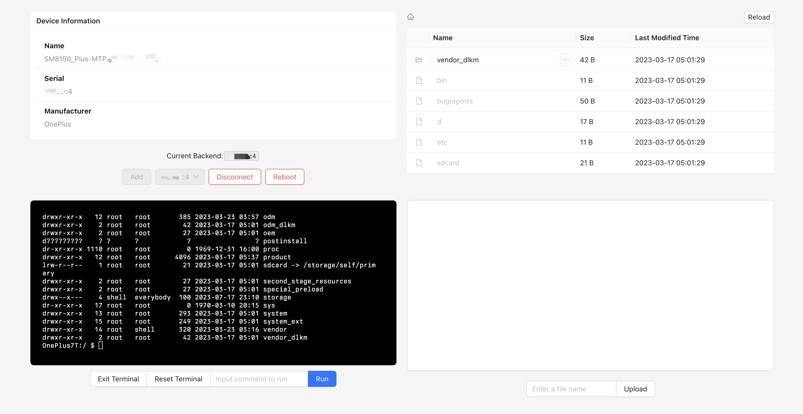

# ya-webadb-starter

[](https://opensource.org/licenses/MIT)



A minimal starter boilerplate for [`ya-webadb`](https://github.com/yume-chan/ya-webadb/blob/main/libraries/adb/README.md) using React and Redux Toolkit in TypeScript. This project demonstrate the uses of following features as modularized React components:
```
./src/components/
├── deviceOperations
│   ├── AddDevice.tsx
│   ├── ConnectDevice.tsx
│   ├── DeviceConnection.tsx
│   ├── DeviceInfo.tsx
│   ├── DisconnectDevice.tsx
│   ├── Reboot.tsx
│   └── SelectDevice.tsx
├── fileManager
│   ├── FileManager.tsx
│   ├── Path.tsx
│   ├── ReadFile.tsx
│   ├── Reload.tsx
│   ├── Table.tsx
│   └── Upload.tsx
└── terminal
    ├── ExitTerminal.tsx
    ├── ResetTerminal.tsx
    ├── RunCommandShell.tsx
    └── Terminal.tsx
```

## Getting Started

1. Clone the `ya-webadb` repo and install it manually by following the instructions in its [CONTRIBUTING.md](https://github.com/yume-chan/ya-webadb/blob/433f9b986f005456576d66a46517021cfde58d8a/CONTRIBUTING.md) file. Currently tested on `v0.0.20` ([`433f9b986f005456576d66a46517021cfde58d8a`](https://github.com/yume-chan/ya-webadb/tree/433f9b986f005456576d66a46517021cfde58d8a)).
2. Install the dependencies from the `ya-webadb` project to this project:
```bash
bash installWebADB.sh <ya-webadb-folder>
# For example:
# bash installWebADB.sh /Users/tommyjtl/Documents/Projects/ya-webadb
```
3. Install the dependencies for this project
```bash
npm install
```

### Running

To run the project, use the following commands:

```bash
npm start
```

To build a production version of the project, use the following commands:

```bash
npm run build
```

## Acknowledgements

- [`ya-webadb`](https://github.com/yume-chan/ya-webadb/) by Yume Chan